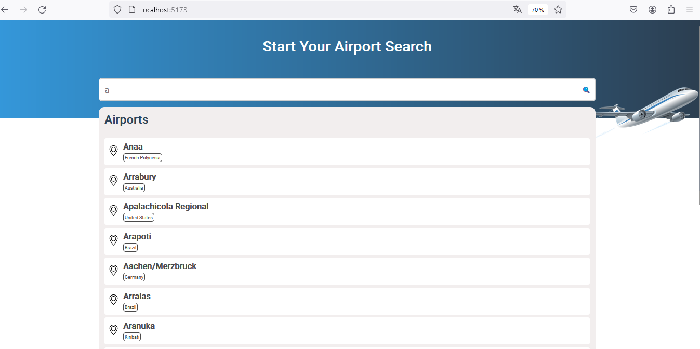
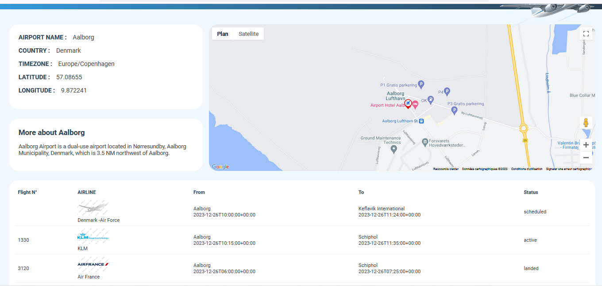

# Avia : Airport search application

A web application designed to search and display information about airports and their associated flights typically involves the integration of airport data and flight information. Here's a brief description of the key features and components included in this app :

1. **Airport Search:**
   - Users can search for airports by name.
   - Autocomplete functionality assists users in finding the correct airport.

2. **Interactive Map:**
   - The application incorporates an interactive map (Google Maps) to visually display the selected airport.
   - Airport markers on the map provide a clear indication of their location.

3. **Airport Information:**
   - Detailed information about the selected airport is displayed, including its name, IATA code, ICAO code, location (latitude and longitude), timezone, country.
   - Additional information are displayed with the help of serpstack api.

4. **Flight Information:**
   - The app provides details about flights departing from the selected airport.
   - Information includes flight numbers, destinations, departure/arrival times, and current status.

**Screenshots from the demo:**
1. Global search :

2. Airport details:

## How to run the project:
1. create an .env file with the following keys:
- VITE_AVIATIONSTACK_API_ENDPOINT
- VITE_AVIATIONSTACK_ACCESS_KEY
- VITE_SERPSTACK_ENDPOINT
- VITE_SERPSTACK_ACCESS_KEY
- VITE_GOOGLE_MAP_API_KEY

2. execute npm install or yarn install

3. execute npm run dev